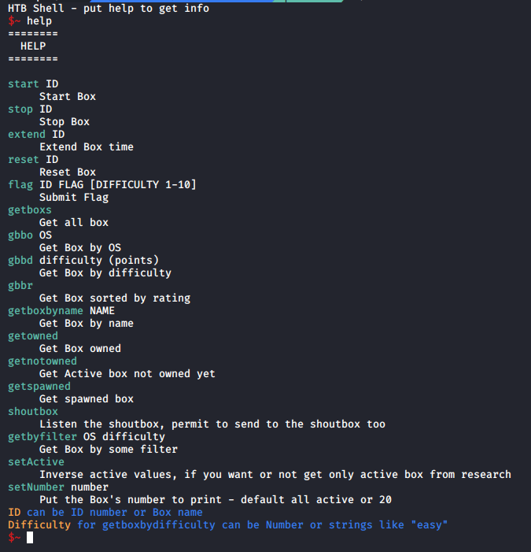
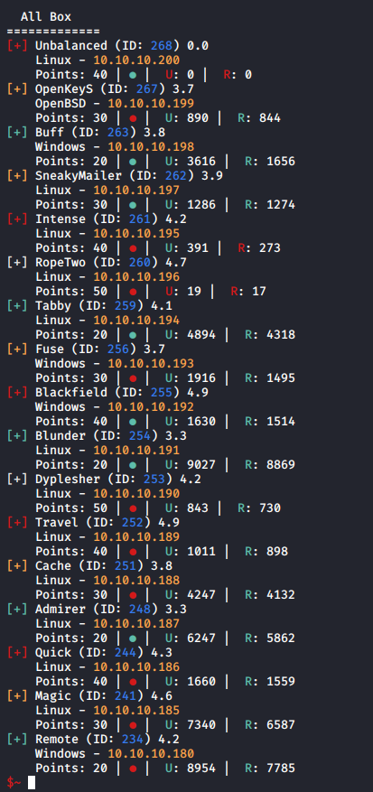

# Hackthebox-API
Little script to handle hackthebox requests

Hackthebox API in CLI

2 Commands to change variables :
- setActive
	- Change this values to True or False to search only active box or not
- setnumber Number
	- Change this number to print only "Number" boxs on some command

# HELP

# All Box

